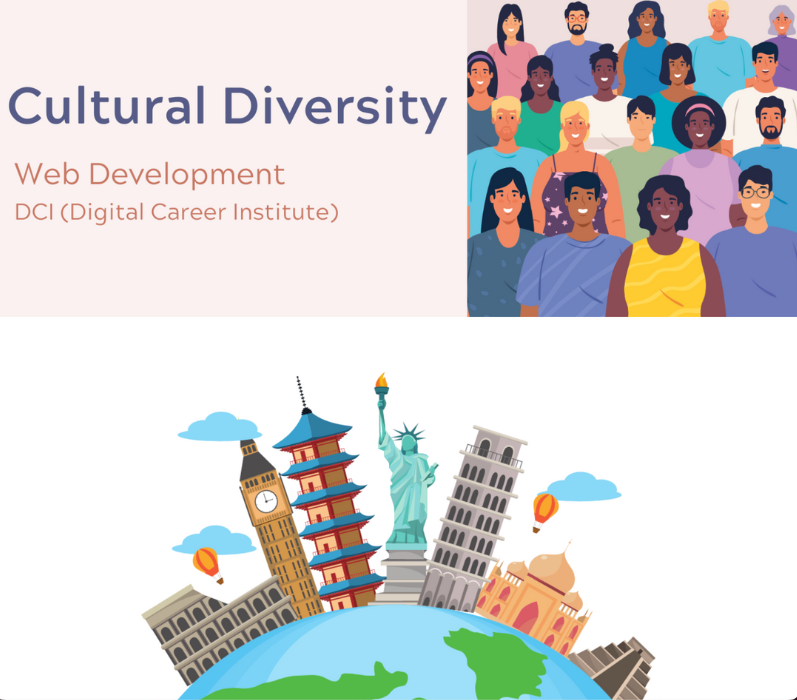

# Mini Project 1 👩🏻‍💻 at Web Development Course
## Cultural Diversity in Our Classroom 🌏
### How do you say in your language?

We are learning not only programming, but also social intelligence and cultural diversity.  
As part of creating opportunities to get to know each other better in this international class, I have put together some simple and useful expressions.

Click below to interact with other countries! ✨   
⬇  
[How do you say in your language?](https://yukosuga.github.io/cultural-diversity/)